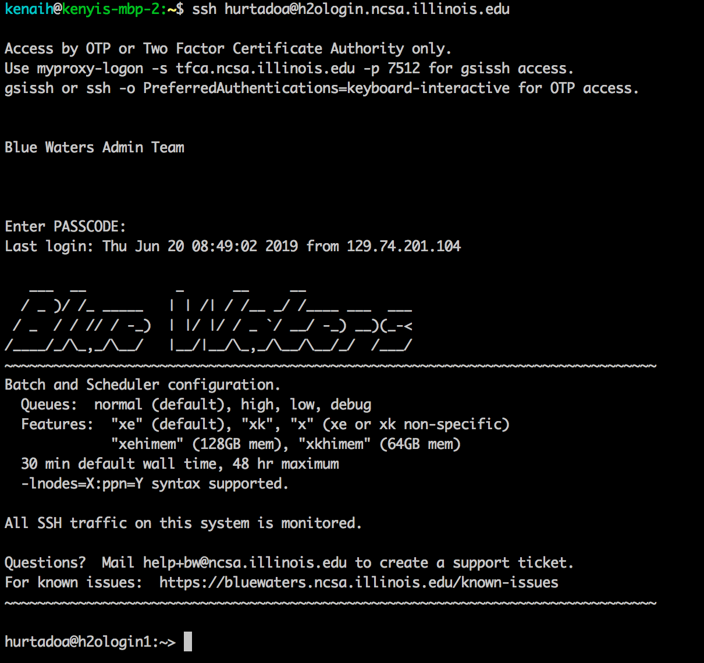
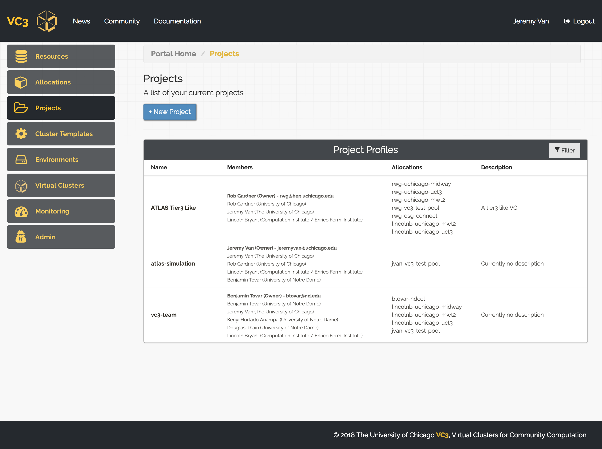

[TOC]

## Overview

Blue Waters require GSI-SSH authentication. The following guide will show you how to create x509 proxy tokens for GSI-SSH authentication in VC3.

## 1. Setting up your VC3 account
If you have not yet configured your VC3 account, follow steps 1 to 4 [this link](https://docs.virtualclusters.org/userguide/gettingstarted/).

## 2. Generating x509 proxies from Blue Waters

We will now log in to the Blue Waters submit node with your username and RSA PIN+Token, as usual (click on the [BW documentation](https://bluewaters.ncsa.illinois.edu/getting-started/#Logging) for more information). E.g.:

```
$ ssh <username>@h2ologin.ncsa.illinois.edu

```

Next, run the following command in order to create the proxy. The command will request for your PIN + RSA Token again. E.g.:

```
$  myproxy-logon -s tfca.ncsa.illinois.edu -p 7512
Enter MyProxy pass phrase:
A credential has been received for user hurtadoa in /tmp/x509up_u57980.
```

Finally, print the output of the certificate and copy the text in your clipboard:

```
cat /tmp/x509up_u57980
```

## 3. Creating a GSISSH allocation in VC3

Clicking My Allocations on the left shows all allocations currently associated
with your account. You may select a new one by clicking + New Allocation.


You will be able to select a resource target from the drop down menu, and enter
an account name for the resource. Select Blue Waters and put your Blue Waters username.


You will now be prompted to a screen where you can paste your x509 proxy certificates.
Paste the output of proxy generated in the previous step and click on "Register Allocation".
 


After that, your allocation will be validated and you will see a screen like below:


Now, you are able to use this allocation! However, keep in mind there is an expiration time
for this allocation, that can be seen in at anytime in the website. 

You will need to click on "Edit Allocation" in order to update your proxy certificate before/once
it expires (by following Step 2 instruction to re-generate a proxy),in order to keep using this allocation
in VC3.

## 4. Defining a project

VC3, as a platform for cooperative scientific computing, allows you create
projects to share your allocations and virtual clusters with trusted members of
your group, laboratory, or collaboration. To start a new project, click
"Projects" on the sidebar, then click "+ New Project".


You may give your project an aribtrary name and choose initial project members and/or allocations.
You are, by default, member of all your projects.
Once finished, click “Create Project”.


You should be returned to the Projects page, where you will be able to see all
of your projects and memberships.
You can access the configuration of each project in the table by clicking on its name.
This way you can add or remove members and/or allocations to a given project.



## 5. Launching a Virtual Cluster
Follow [this section](https://docs.virtualclusters.org/userguide/gettingstarted/#10-launching-a-virtual-cluster) for general instructions regarding launching a virtual cluster.
For a REANA cluster, click on the following [link](https://github.com/vc3-project/vc3-mkdocs/blob/master/docs/userguide/reana.md).
