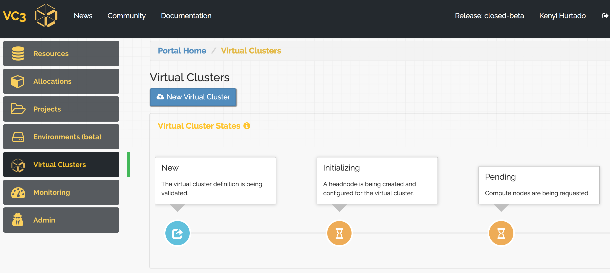
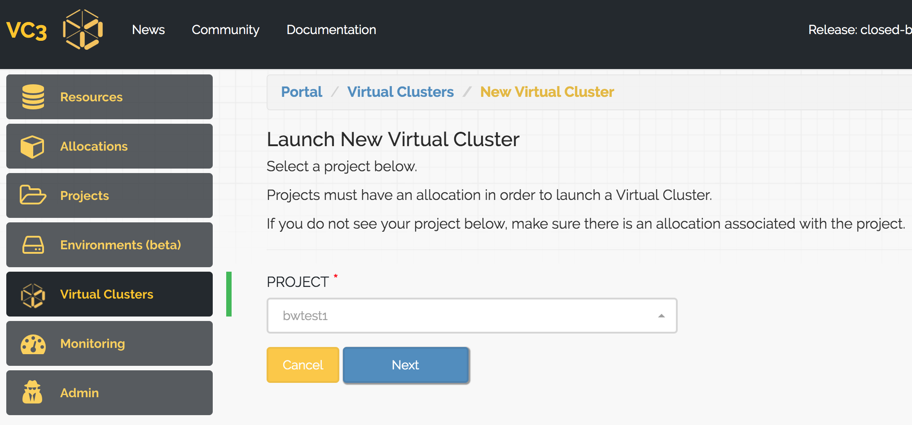
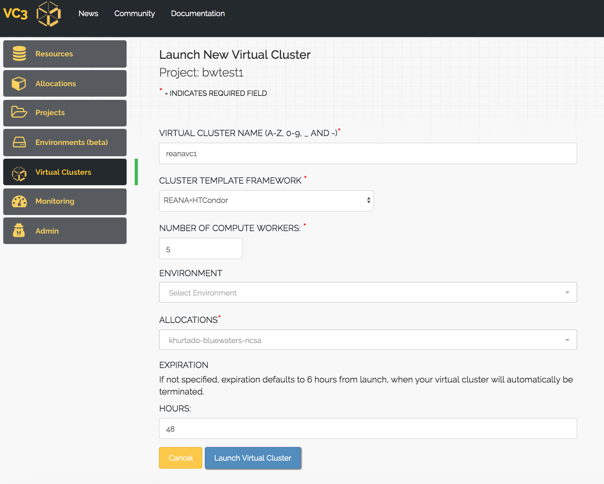
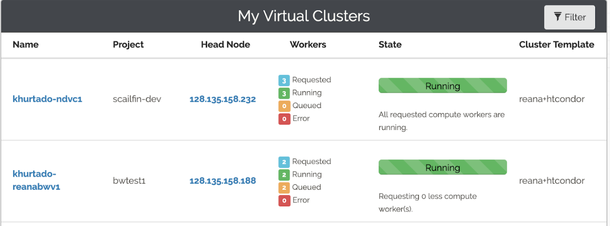

[TOC]

## Overview

The following guide will show you how to create a REANA+HTCondor cluster in VC3.

## Pre-Requisites
This guide assumes you have already setup your VC3 account and at least one allocation. 
- If you have not yet configured your VC3 account, follow steps 1 to 4 in [this link](https://docs.virtualclusters.org/userguide/gettingstarted/).
- For allocations, follow step 5 in the previous link for allocations with SSH-keys, or click on the [following link](https://github.com/vc3-project/vc3-mkdocs/blob/master/docs/userguide/bluewaters.md) to setup a Blue Waters allocation based on GSI-SSH.

## Creating a Virtual Cluster
To launch a virtual cluster, click on "New Virtual Cluster", found in the Virtual Clusters tab from the left nav-menu.



Next, select a project to work with.



Give your Virtual Cluster a name, select "REANA+HTCondor" as the cluster template, choose
the number of compute workers and select an allocation to work with.
You may specify how long you would like your Virtual Cluster to run for. If not
specified, the expiration defaults to 6 hours. Which means that after 6 hours,
your Virtual Cluster will automatically begin to terminate itself.

Then, click on "Launch Virtual Cluster"


Once launched, you will be redirected to your Virtual Cluster detailed page,
where you may track the status if your Virtual Cluster.
The head node should take a few moments to configure.
Once complete, you will be prompted with instructions on how to access the head node.



## Using REANA

Once you SSH into your head node, you can start using reana-client and reana-cluster commands, normally.
Your environment will already have the server url and secret of your REANA cluster. You can ping the cluster with:

```
reana-client ping
```
