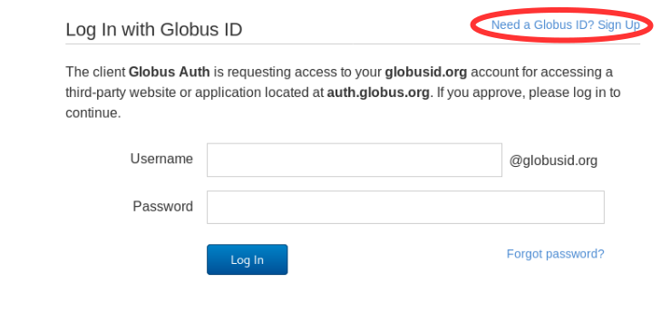
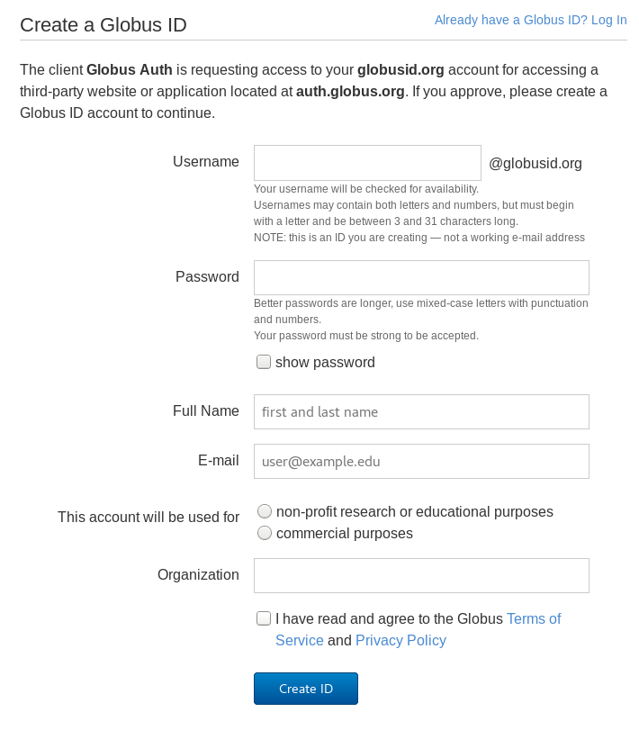
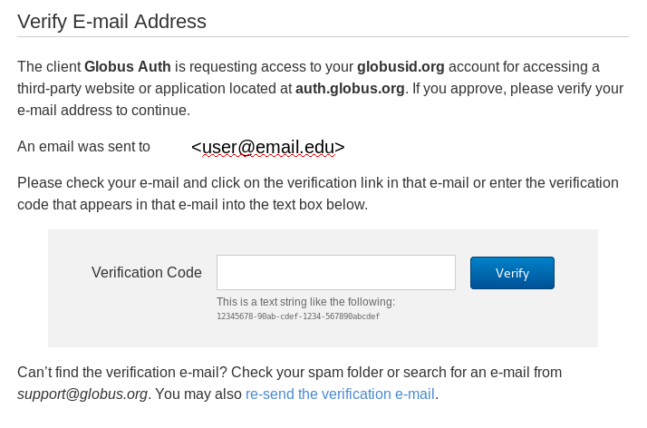
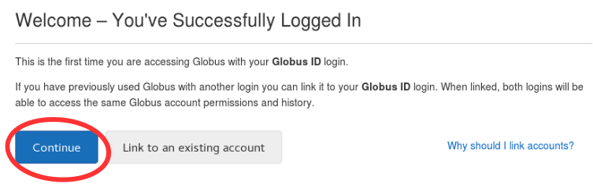
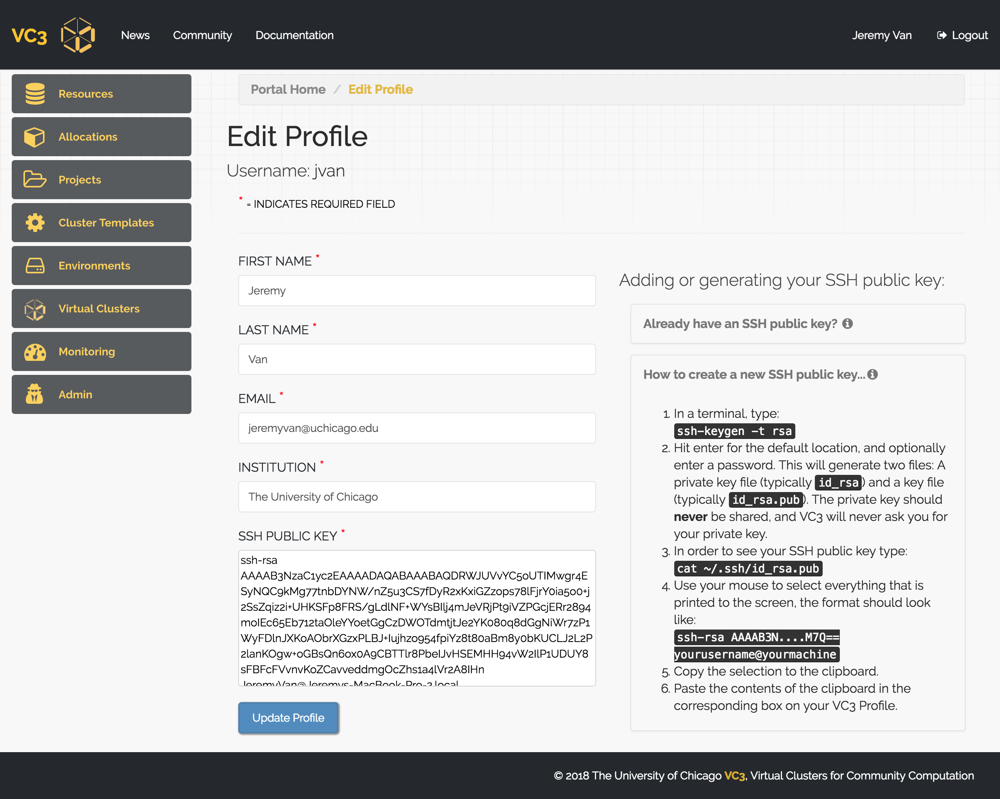
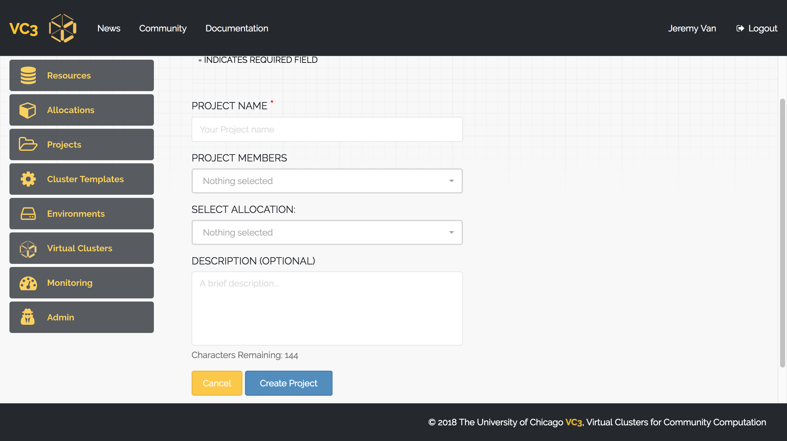
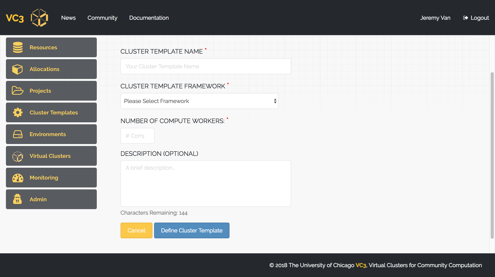
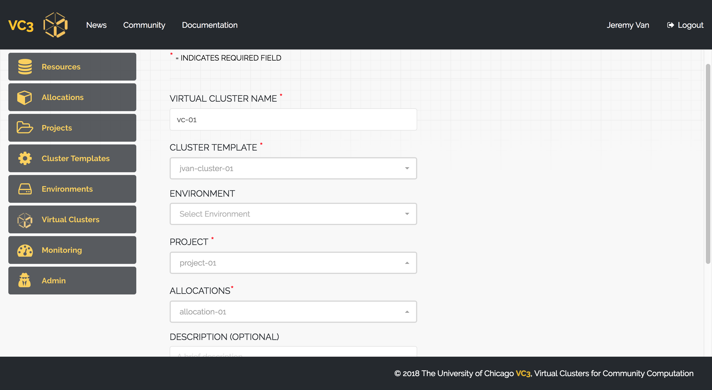

# VC3 User Guide

### Building Your First Virtual Cluster
**Prerequisites**

In order to use VC3, you’ll need an allocation or account with with a supported target resource. These include, but are not limited to:

  - University of Chicago - Research Computing Center
  - University of Notre Dame - Center for Research Computing
  - National Energy Research Scientific Computing Center (NERSC)
  - Pittsburgh Supercomputing Center (Bridges)
  - Open Science Grid
  - and more!

Institutions and resources are added frequently. Check the [Resources](https://www.virtualclusters.org/resources) page for the full list of connected resources in the service.

### 1. Login or Create Account

When you first visit [Virtual Clusters](https://www.virtualclusters.org), you’ll
be presented with a Login link in the top right of the screen. Click “Login” -
this will take you to a [Globus](https://globus.org) sign-in site.

### 2. Sign in to Globus

You will then be asked to sign in with your institutional identity, or your
Globus ID. If you are using the former, simply type in the name of your
institution and click "Continue". Proceed to [Step 3a](###3a.-Login-with-your-institutional-ID).

Otherwise, click "Globus ID to sign in" and proceed to the alternate Step 3b.

### 3a. Login with your institutional ID

You should be presented with a login page for your institutional ID, with your
institution’s branding. Go ahead and sign-in now. Note that your password is not
sent to the VC3 or Globus web portals. Continue to step 4.

### 3b. Login with your Globus ID

Once you have clicked on the "Globus ID to sign in" link, you will be presented with the page below. Please, proceed to log in if you already have a globus account, or click on the upper right link to create a new globus account.

If you are creating a new account, a short form to fill up will be shown next (see below).

 After you have completed this form, a confirmation e-mail with a verification code will be sent. Copy and paste such code and click on the "verify" button.
 

After your account is verified, you will be presented with the page below. Click on "Continue" to finalize the sign up process.

## Complete or update your VC3 profile

Once you have signed in, you’ll be asked to update or complete your VC3 profile
with information such as your Institution and any other information we cannot
directly extract from your Globus account. Click “Update Profile” once done.

## Connect an Allocation

After updating your profile, you can connect an allocation to the VC3 service.
An allocation, in VC3, is defined as combination of a username and resource
target that consumes some type of compute unit - regardless of whether it is
billed as Service Units (many HPC centers), dollars (AWS, GCE), or priority
(HTCondor and other opportunistic systems).

Clicking My Allocations on the left shows all allocations currently associated
with your account. You may select a new one by clicking Connect Allocation.

You will be able to select a resource target from the drop down menu, and enter
an account name for the resource. This is the same account name that you use to
SSH to the remote system.

Once you’ve connected your allocation, the system will validate it.

In order to create a virtual cluster, the VC3 software needs to be able to SSH
to the remote resource. If you click your allocation, you should see a section
titled Public Token.

You will need to add this token to your Unix account, in the file
~/.ssh/authorized_keys. You can either edit this file with your favorite editor
(such as nano, vim, or emacs), or use the echo command to append it to the
authorized keys file.

This token allows the VC3 system to SSH into a cluster as yourself and submit
jobs on your, or your project’s, behalf.

## Defining a Project

VC3, as a platform for cooperative scientific computing, allows you create
projects to share your allocations and virtual clusters with trusted members of
your group, laboratory, or collaboration. To start a new project, click
“Projects” on the sidebar, then click “+ New Project”.

You may give your project an aribtrary name and choose initial project members.
Once finished, click “Create Project”.

You should be returned to the Projects page, where you will be able to see all
of your projects and memberships.

## Creating a Cluster Template

VC3 allows users to create “Cluster Templates” that describe the components of
their virtual cluster, including number of head nodes, worker nodes, etc. We
currently support HTCondor and WorkQueue clusters with dynamic worker nodes,
and fixed head nodes.

To define a new template, click the “Cluster Templates” link on the left panel.
You’ll be able to give your cluster a name, select framework, and number of
workers. Click “Define Cluster” to finish creating the template.

## Resources

The VC3 team curates an ever-expanding list of resources for end-users, with a
focus on Campus Clusters, HPC centers, and Cloud resources. You can find these
resources by clicking the “Resources” link on the left panel.

You can also click an individual resource and see expanded information, such as
batch system type, links to documentation, etc.

## Launching a Virtual Cluster

